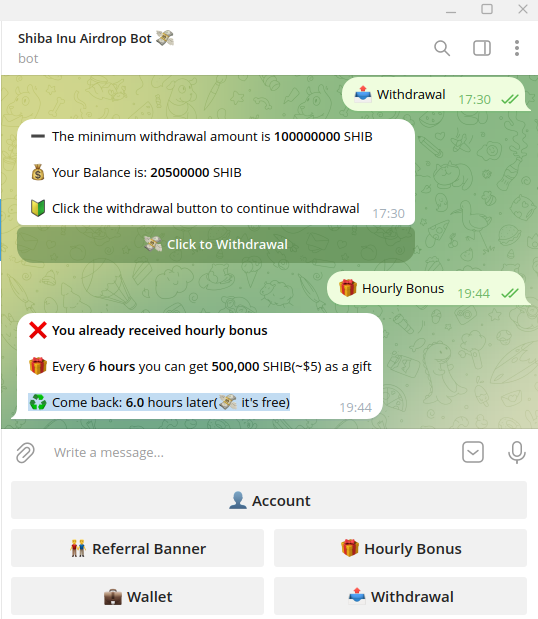

# AirdropAutoGet

Get Airdrop from Telegram Autoly


## Prepare

1. Join Shi TG Bot and Complete the guided mission
🎁 Join now and get 20,000,000(~$190) SHIB gift for free 🎁
Join link： https://t.me/OfficialShibaAirdropBot?start=5319439452

2. install python requirements
```python
pip install -r requirements.txt
```
3. get your `api_id` and `api_hash` from https://my.telegram.org/apps

4. config your `api_id` and `api_hash` in `.env`
```bash
cp .env.example .env
```

## Run

```python
python get_shib_airdrop.py
```
Then login your Telegram account

## Verify

Congrats! see

